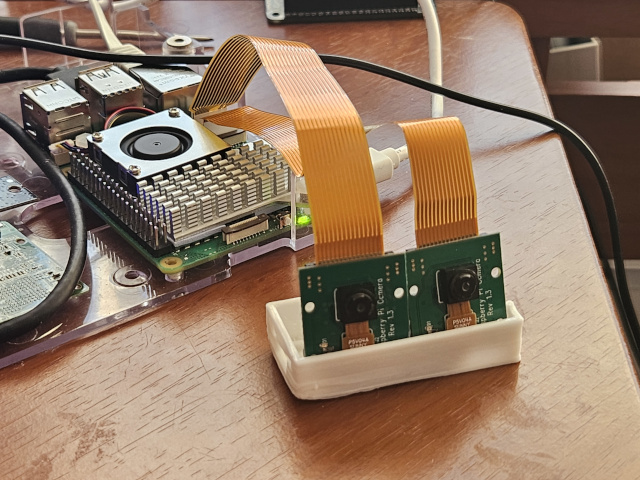

# pi-eyed
3D photo/video using pi5 and dual cameras

- connect 2 camera modules to pi 5
- align side by side

cam3d.sh takes 2 pictures, and saves 
 - side by side picture for cross eyed viewing
 - gif
